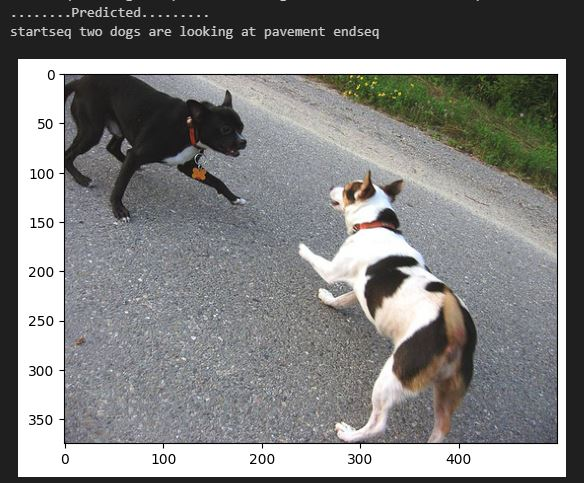
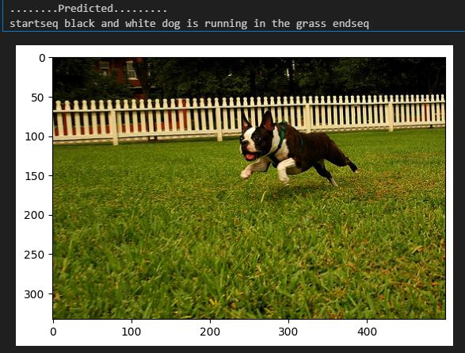
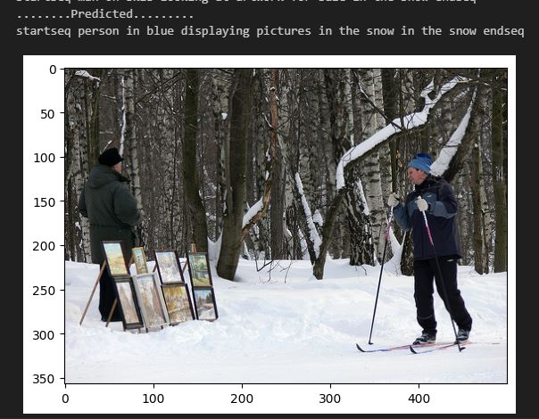
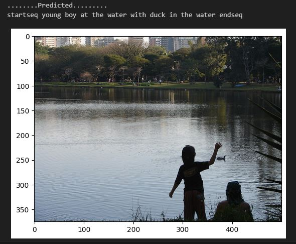

## Image Captioning with LSTM and CNN (VGG16)
This project implements an image captioning model using a combination of Convolutional Neural Networks (CNN) and Long Short-Term Memory (LSTM) networks. The CNN model (VGG16) is used to extract image features, and the LSTM is used to generate captions based on those features. The model is trained using the Flickr8k dataset.
 
 ## The dataset used:
Flickr8k: A dataset consisting of 8,000 images with corresponding captions. The dataset is used to train the image captioning model.

### Key Technologies:
- TensorFlow
- Keras
- VGG16
- LSTM
- Python

### Requirements
- TensorFlow >= 2.0
- NumPy
- Matplotlib
- Keras
- Pillow (for image preprocessing)
- NLTK (for tokenization)

## Steps :

### 1. Import Required Modules

- TensorFlow/Keras for model creation and training.

- Numpy and Pandas for data handling.

- Matplotlib for visualization.

### 2. Preprocessing Captions

- Clean the raw captions: remove special characters, convert to lowercase, and tokenize.

- Build a vocabulary based on tokenized captions, limiting to the most frequent words.

- Map captions to corresponding image IDs for training.
### 3. Preprocessing Image Data

- Extract features from images using the pre-trained VGG16 model.

- Save extracted features in features.pkl for efficient reuse.

### 4. Train-Test Split
- Split the dataset into training and testing sets to evaluate the model's performance.
### 5. Model Creation
- Image Encoder: Fully connected layers on top of the extracted VGG16 features.

- Caption Decoder: Embedding layer followed by LSTM layers.

- Final Output: Dense layer with softmax activation to predict the next word in the sequence.
### 6. Training the Model
- Use the Flickr8k training set to fit the model.

- Employ categorical cross-entropy loss and Adam optimizer.

- Train the model for 20 epochs with a batch size of 32.
### 7. Generate Captions

### 8. Results

    The model's performance was evaluated using BLEU scores:

    - BLEU-1: 0.382760
    - BLEU-2: 0.167346

